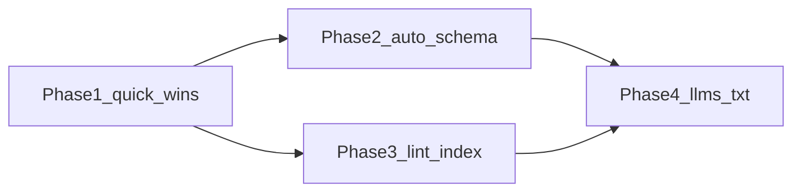

# SEO and Agent Discoverability Pipeline Review

**Date:** 2026-09-13  
**Scope:** `ssc-vault/website` — Markdown frontmatter, Quartz transformers/emitters, custom `Head.tsx`, sitemap/RSS/robots, and machine-readable indexes.  
**Method:** Static inspection of build output (`.quartz/public/`), source under `.quartz/quartz/`, content frontmatter sampling, and comparison against current search-engine and AI-crawler guidance (Google Search Central, schema.org Article guidance, llms.txt / AI crawler literature, 2025–2026 SEO practitioner consensus). Implementation proceeds in numbered phases below.  
**Plan tag:** `seo_pipeline_review` (each phase → one plan under `.cursor/plans/`)

## Executive summary

The site already has a **solid SEO foundation** relative to stock Quartz: a customized `Head.tsx` reads rich frontmatter and emits title, description, canonical, Open Graph, Twitter Card, and optional JSON-LD. A `Description` transformer auto-generates ~150-character fallbacks from body text. Sitemap and RSS are enabled; HTML is **fully pre-rendered** at build time (SPA navigation does not block crawlers from reading article bodies in the initial HTML).

The pipeline is **under-utilized and partially misaligned** with the live canonical host (`www.ssc.studio`):

| Area                             | Assessment                                                                                     |
| -------------------------------- | ---------------------------------------------------------------------------------------------- |
| Meta tag generation (`Head.tsx`) | Good coverage; missing a few modern tags                                                       |
| Frontmatter discipline           | Weak — 71% of published pages lack `headDescription`; JSON-LD on 6 pages only                  |
| URL consistency                  | **Broken** — `robots.txt` and several `structuredData` blocks still reference `clinamenic.com` |
| Structured data                  | Manual, sparse, stale URLs; no auto-generation from existing author/date/license fields        |
| Crawl budget / index quality     | 233 sitemap URLs including ~113 thin `zettel` notes; no `noindex` strategy for low-value pages |
| Agent/LLM discoverability        | Accidental strengths (`searchIndex.json`, static HTML); no intentional agent layer             |

**Highest-impact fixes (P0):** correct `robots.txt` sitemap URL; align all JSON-LD and `mainEntityOfPage` URLs to `https://www.ssc.studio`; add build warnings for missing `headDescription` on indexable types.

**Highest-impact enhancements (P1):** auto-generate `Article` / `BlogPosting` JSON-LD for `type: writing`; default `ogType: article` for essays; site-wide `WebSite` + `Organization` schema on homepage; optional `llms.txt` curated manifest.

## Locked decisions

| Decision | Choice |
| -------- | ------ |
| Canonical host in robots, JSON-LD, and sitemap | `https://www.ssc.studio` |
| `pageTitle` (RSS / OG fallback) | `Clinamenic LLC` |
| Index zettel notes | **noindex** by default; opt-in `index: true` for showcase notes (Phase 3) |
| AI training crawlers | Allow all for now (preserve citation potential); revisit with policy |
| Syndicated essays | Self-canonical on ssc.studio; link `publication-url` via schema `isBasedOn` (Phase 2) |
| Auto vs manual JSON-LD | **Merge** — auto baseline + frontmatter override (Phase 2) |
| llms.txt | **Static curated** list, revisit quarterly (Phase 4) |
| Body prose / `authorURL` still on clinamenic.com | Deferred past Phase 1 |
| Deploy to Tekhnema | Only when explicitly requested |

## Phase dependency



---

## 1. Current pipeline (as implemented)

### 1.1 Data flow

```
Markdown frontmatter + body
        │
        ▼
  FrontMatter transformer
        │
        ▼
  Description transformer ──► fileData.description (≤150 chars from body if no frontmatter.description)
        │
        ▼
  ExplicitPublish filter (publish: true required)
        │
        ├── ContentPage emitter ──► HTML + Head.tsx meta tags
        ├── ContentIndex emitter ──► sitemap.xml, index.xml (RSS), searchIndex.json, contentIndex.json
        └── AliasRedirects ──► UUID permalink pages (noindex meta-refresh)
```

### 1.2 Frontmatter fields consumed for SEO

Documented in `.workspace/docs/arch/seo-frontmatter-strategy.md` and implemented in `.quartz/quartz/components/Head.tsx`:

| Field                                          | Consumed by                                                 | Fallback chain                                            |
| ---------------------------------------------- | ----------------------------------------------------------- | --------------------------------------------------------- |
| `title`                                        | `<title>`, `og:title`, `twitter:title`                      | i18n default                                              |
| `headDescription`                              | `meta description`, `og:description`, `twitter:description` | `subtitle` → `fileData.description` (auto) → i18n default |
| `keywords`                                     | `meta keywords`                                             | none                                                      |
| `bannerURI`                                    | `og:image`, `twitter:image`                                 | site default `static/og-image.png`                        |
| `canonicalUrl`                                 | `<link rel="canonical">`, `og:url`                          | `https://{baseUrl}/{slug}`                                |
| `ogType`, `ogSiteName`, `ogUrl`                | Open Graph                                                  | `website`/`article` heuristic; `cfg.pageTitle`            |
| `twitterCard`, `twitterSite`, `twitterCreator` | Twitter Card                                                | `summary_large_image` if banner present                   |
| `structuredData`                               | `<script type="application/ld+json">`                       | none (optional per page)                                  |
| `headIcon`                                     | favicon                                                     | `static/icon.png`                                         |
| `lang`                                         | `<html lang>` via `renderPage.tsx`                          | `cfg.locale` prefix                                       |

**Not wired into Head/SEO today** (but present on many pages): `author`, `authorURL`, `date`, `license`, `publication-url`, `uuid`, `tags`, `type`.

### 1.3 Description transformer behavior

`Description` (`.quartz/quartz/plugins/transformers/description.ts`):

- Default length: **150 characters** (sentence-aware truncation).
- Strips/replaces external URLs in generated text (good for snippet cleanliness).
- Populates `fileData.description` used as fallback when `headDescription` is absent.

This means pages without `headDescription` still get a meta description, but it is **auto-truncated body text** — often weaker for CTR and may start mid-thought rather than with a crafted summary.

### 1.4 Head.tsx output (verified on build)

Example: `writing/Pre-Constitutional-Governance` emits:

- Unique `<title>` matching visible H1
- `meta description` from `headDescription`
- Self-referencing canonical at `https://www.ssc.studio/writing/Pre-Constitutional-Governance`
- Full Open Graph set including default 1200×630 image
- Twitter Card with `@clinamenic` creator
- **No JSON-LD** on this page (despite rich author/date/license frontmatter)

Example: `about/index` emits JSON-LD `AboutPage`, but `@id` and organization URL still say `https://clinamenic.com/about` while canonical is `https://www.ssc.studio/about`.

### 1.5 Discovery artifacts

| Artifact       | Location                    | Notes                                                                     |
| -------------- | --------------------------- | ------------------------------------------------------------------------- |
| Sitemap        | `/sitemap.xml`              | 233 URLs; tag pages excluded; all published content with body             |
| RSS            | `/index.xml`                | Last 10 items (`rssLimit: 10`); channel title = `cfg.pageTitle` ("Index") |
| Robots         | `/robots.txt`               | **Points sitemap to `https://www.clinamenic.com/sitemap.xml`**            |
| Search index   | `/static/searchIndex.json`  | Full text for `searchable` types only                                     |
| Graph index    | `/static/contentIndex.json` | Metadata only (title, links, tags, date, type)                            |
| UUID redirects | `/{uuid}`                   | `noindex` meta refresh to slug URL                                        |

### 1.6 Content-type interaction with SEO

From `contentType.ts`:

| `type`                                            | Searchable            | Typical SEO role                                        |
| ------------------------------------------------- | --------------------- | ------------------------------------------------------- |
| `writing`                                         | yes                   | Primary long-form content — should carry Article schema |
| `site-page`, `homepage`, `service`, `publication` | yes                   | Marketing / portfolio pages                             |
| `text` (zettelgarten/ref/)                        | **no**                | Reference texts — still in sitemap, not in searchIndex  |
| `zettel`                                          | yes (default profile) | 113 published notes — indexed in search + sitemap       |
| unregistered types                                | default profile       | Treated as searchable                                   |

---

## 2. Frontmatter coverage audit

Counts from published Markdown (`publish: true`, 233 files):

| Metric                    | Count | % of published |
| ------------------------- | ----- | -------------- |
| Has `headDescription`     | 68    | 29%            |
| Missing `headDescription` | 165   | 71%            |
| Has `structuredData`      | 6     | 2.6%           |
| Has `canonicalUrl`        | 0     | 0%             |

**Pages with manual JSON-LD today:** `index.md` (via homepage — none), `about.md`, `writing.md`, `services.md`, `typography.md`, `zettelgarten.md`, `writing/Retrospective on Ethereum Localism Knowledge Garden.md`.

**Marketing pages** (homepage, about, writing portfolio, services) have thoughtful `headDescription`, keywords, and JSON-LD. **Individual essays** usually have `headDescription` when authored recently, but many older posts and nearly all services/projects/zettel pages do not.

**`ogType` on writing essays:** Most set `ogType: website` in frontmatter. Google's OG type and schema `@type` should be `article` / `BlogPosting` for essays — `website` is appropriate for section indexes, not individual posts.

---

## 3. Gap analysis vs SEO best practices (2025–2026)

Sources: [Google Search Central — title links](https://developers.google.com/search/docs/appearance/title-link), [Article structured data](https://developers.google.com/search/docs/appearance/structured-data/article), [Publication dates](https://developers.google.com/search/docs/appearance/publication-dates), and current practitioner consensus on meta descriptions, canonicals, and OG tags.

### 3.1 What we do well

1. **Unique titles per page** tied to visible H1 (`article-title` class on writing layout).
2. **Self-referencing canonical URLs** derived from `baseUrl` + slug (correct domain in `<link rel="canonical">`).
3. **Open Graph and Twitter Card basics** on all pages with sensible image fallback.
4. **Static HTML with full article body** in initial response — crawlers and fetch-based agents do not need to execute JS for main content (SPA enhances navigation but does not hide content).
5. **Sitemap with `lastmod`** from frontmatter/filesystem dates.
6. **UUID redirect pages use `noindex`** — avoids duplicate indexing of permalink hops.
7. **Existing internal SEO strategy doc** (`.workspace/docs/arch/seo-frontmatter-strategy.md`) with field definitions and examples.

### 3.2 Critical issues (P0)

#### A. `robots.txt` sitemap URL is wrong

Current `website/robots.txt`:

```
Sitemap: https://www.clinamenic.com/sitemap.xml
```

Live canonical host per `website_publish.mdc` and `quartz.config.ts` is **`https://www.ssc.studio`**. Crawlers reading robots on the live site are directed to a **different domain's sitemap** (legacy GitHub Pages / clinamenic.com). This breaks sitemap discovery for any bot that trusts robots.txt.

Also: `Allow: /service.xml` appears to be a stale path; RSS is emitted at `/index.xml`.

#### B. JSON-LD URLs disagree with canonical

Section pages embed `structuredData` with `mainEntityOfPage.@id` and organization URLs on **`clinamenic.com`**, while HTML canonical and OG URLs use **`ssc.studio`**. Google recommends structured data URLs match canonical metadata ([structured data guide](https://developers.google.com/search/docs/appearance/structured-data/sd-policies)).

#### C. No enforcement of SEO frontmatter contract

The strategy doc marks `headDescription` as **Required**, but the build emits pages silently when it is missing. 165 published pages rely on auto-truncated body text for snippets.

### 3.3 Important gaps (P1)

| Gap                                                    | Impact                                                               | Best practice                                                                                                                                                                                                              |
| ------------------------------------------------------ | -------------------------------------------------------------------- | -------------------------------------------------------------------------------------------------------------------------------------------------------------------------------------------------------------------------- |
| No auto `Article` / `BlogPosting` JSON-LD              | Misses rich-result eligibility, weak entity signals for author/dates | Recommend `headline`, `author`, `datePublished`, `dateModified`, `image`, `publisher`, `mainEntityOfPage` for essays ([Google Article docs](https://developers.google.com/search/docs/appearance/structured-data/article)) |
| `ogType: website` on essays                            | Suboptimal OG semantics                                              | Default `article` for `type: writing`; `website` for indexes only                                                                                                                                                          |
| `pageTitle: "Index"` in config                         | Weak RSS channel title and OG site name fallback                     | Use `"Clinamenic LLC"` or `"SSC Studio"`                                                                                                                                                                                   |
| No global `twitter:site`                               | Incomplete Twitter Card attribution                                  | Set `@clinamenic` in config or Head default                                                                                                                                                                                |
| No `WebSite` + `SearchAction` on homepage              | Misses sitelinks search box eligibility                              | JSON-LD on homepage pointing to `/` search                                                                                                                                                                                 |
| No `BreadcrumbList` schema                             | Weaker navigation context in rich results                            | Auto-generate from slug segments for nested pages                                                                                                                                                                          |
| `keywords` meta maintained widely                      | Low Google ranking value (2026 consensus)                            | Optional internal use only; do not invest editorial time                                                                                                                                                                   |
| 113 published `zettel` pages in sitemap                | Crawl budget dilution; thin/duplicate snippets                       | `noindex` or exclude from sitemap unless curated for public discovery                                                                                                                                                      |
| `type: text` reference works in sitemap but not search | Inconsistent discovery policy                                        | Decide: public reference library (keep) vs private notes (noindex)                                                                                                                                                         |
| No `og:image:alt`                                      | Accessibility and OG completeness                                    | Alt text from `title` or dedicated frontmatter                                                                                                                                                                             |
| Syndicated originals (`publication-url`)               | Potential duplicate content vs Substack                              | Use `canonicalUrl` or `rel=canonical` pointing to original when intentionally syndicated                                                                                                                                   |

### 3.4 Minor / nice-to-have (P2)

- `theme-color`, `apple-touch-icon`, `manifest` for PWA polish (not ranking factors).
- `hreflang` if multilingual content expands (`lang` frontmatter exists but single-locale today).
- RSS `rssFullHtml: true` for full-content feeds (trade-off: payload size).
- Build-time Rich Results validation hook (CI step calling Google's test API or schema validator).
- Per-page `meta robots` for draft-adjacent pages (changelog, boilerplate) if they should not rank.

---

## 4. LLM and agent discoverability

This section covers how AI crawlers, answer engines, and coding/research agents find and interpret site content — distinct from traditional SERP SEO but increasingly relevant for a public knowledge garden.

### 4.1 How agents consume our site today

| Signal                      | Agent utility                                                   | Current state                                                                   |
| --------------------------- | --------------------------------------------------------------- | ------------------------------------------------------------------------------- |
| Static HTML body            | Primary fetch target for GPTBot, ClaudeBot, PerplexityBot, etc. | **Strong** — full prose in `<article>`                                          |
| `<title>`, meta description | Snippet selection, query matching                               | **Good** where `headDescription` exists; weak elsewhere                         |
| JSON-LD                     | Entity extraction (author, dates, type)                         | **Sparse** — 6 pages; URLs stale                                                |
| `searchIndex.json`          | Full-text corpus with titles/tags                               | **Strong** for on-site search; publicly reachable at `/static/searchIndex.json` |
| `contentIndex.json`         | Graph/metadata without body                                     | Useful for site structure mapping                                               |
| Sitemap                     | URL discovery                                                   | **Broken discovery** via robots.txt wrong domain                                |
| UUID permalinks             | Stable citations (`/{uuid}`)                                    | **Strong** for agents that resolve UUID links; redirect is `noindex` (correct)  |
| Semantic HTML               | Heading hierarchy, `<article>`, `<time datetime>`               | **Good** on writing layout (H1, subtitle, author, publish date)                 |
| SPA (micromorph)            | Client-side navigation                                          | Low risk — initial HTML complete                                                |

**Net:** Agents that fetch individual essay URLs get readable, well-structured HTML. Agents that rely on sitemap discovery or structured entity graphs get a **degraded** picture because of robots.txt mispoint and missing Article schema on 95%+ of writing pages.

### 4.2 AI crawler access (`robots.txt`)

Major AI crawlers (GPTBot, OAI-SearchBot, ClaudeBot, PerplexityBot, Google-Extended) **respect robots.txt** for training vs search crawlers. Current policy: `Allow: /` (fully open).

**Strategic choice required:**

| Goal                                  | robots.txt approach                                                                       |
| ------------------------------------- | ----------------------------------------------------------------------------------------- |
| Maximize AI search citations          | Allow search-oriented bots; optionally block training-only bots (Google-Extended, GPTBot) |
| Minimize training use of content      | Disallow training bots; accept reduced AI visibility                                      |
| Protect thin zettel/back-office pages | Disallow `/zettelgarten/` paths except curated hubs                                       |

Recommendation: **Explicit documented policy** in robots.txt comments plus optional `Disallow` for non-public paths (`.workspace` is not emitted; internal zettel may need rules).

### 4.3 `llms.txt` — optional, not a ranking lever

[llms.txt](https://llmstxt.org/) is a proposed Markdown manifest at site root listing curated pages for LLM context. Evidence (2025–2026):

- Major answer engines **do not depend** on it for citation ([studies show near-zero fetch rates](https://maxaeo.ai/blog/does-llms-txt-work/)).
- Google states it does **not** affect Search rankings.
- Chrome Lighthouse may audit it for **agentic browsing** (future-facing).
- **Low-cost, potentially useful** for coding assistants and human-initiated agent fetches.

**Recommendation for this site:** Publish a hand-curated `llms.txt` at `https://www.ssc.studio/llms.txt` listing:

- Homepage, about, services, writing portfolio
- Top 10–20 flagship essays (governance, zettelkasten methodology)
- Explicit note that UUID permalinks are stable citation targets
- Link to `sitemap.xml` and optional `searchIndex.json` for machine discovery

Keep it **short and maintained** — stale llms.txt is worse than none.

### 4.4 Agent-optimized content patterns (no new format required)

Practices that improve legibility for both Google and LLMs without separate pipelines:

1. **Lead with a clear abstract** — first paragraph should stand alone; aligns with good meta descriptions.
2. **Stable heading hierarchy** — one H1, logical H2/H3 (already mostly true on writing layout).
3. **Visible dates matching schema** — `date` frontmatter renders as `<time datetime>`; auto JSON-LD should mirror it exactly ([Google date guidelines](https://developers.google.com/search/docs/appearance/publication-dates)).
4. **Explicit author identity** — `author` + `authorURL` frontmatter should flow into JSON-LD `author.url` (currently only visible in body chrome).
5. **License clarity** — CC license already rendered; add `license` URL to JSON-LD `CreativeWork.license`.
6. **Avoid critical content in iframe-only embeds** — e.g. Substack embed on writing portfolio is fine as supplement, not as sole description.
7. **Machine-readable indexes** — consider documenting `/static/searchIndex.json` in llms.txt for agents building site-wide RAG (with rate-limit courtesy note).

### 4.5 SPA consideration

`enableSPA: true` uses micromorph for client navigation. Because Quartz **pre-renders** full HTML at build time, standard crawlers and `curl`-based agents receive complete content. Monitor if future dynamic-only features are added — any content loaded only post-navigation would harm both SEO and agent legibility.

---

## 5. Recommended improvements (prioritized)

### P0 — Fix before next deploy

| #   | Action                                                                                                  | Owner layer                 |
| --- | ------------------------------------------------------------------------------------------------------- | --------------------------- |
| 1   | Update `robots.txt`: `Sitemap: https://www.ssc.studio/sitemap.xml`; fix RSS path comment (`/index.xml`) | content root `robots.txt`   |
| 2   | Replace `clinamenic.com` URLs inside all `structuredData` frontmatter with `https://www.ssc.studio/...` | content `.md` files         |
| 3   | Add build warning (or fail in CI) when `publish: true` + indexable `type` lacks `headDescription`       | Quartz plugin or npm script |
| 4   | Change `pageTitle` in `quartz.config.ts` from `"Index"` to `"Clinamenic LLC"`                           | config                      |

### P1 — High-value pipeline enhancements

| #   | Action                                                                                                                                                              | Owner layer                          |
| --- | ------------------------------------------------------------------------------------------------------------------------------------------------------------------- | ------------------------------------ |
| 5   | **Auto JSON-LD in `Head.tsx`** for profiles: `writing` → `BlogPosting`; `service`/`publication` → `Service`/`CreativeWork`; `homepage` → `WebSite` + `Organization` | `.quartz/quartz/components/Head.tsx` |
| 6   | Merge manual `structuredData` frontmatter with auto-generated schema (frontmatter overrides)                                                                        | Head.tsx                             |
| 7   | Default `ogType` to `article` when `type: writing` unless frontmatter overrides                                                                                     | Head.tsx                             |
| 8   | Set default `twitter:site: "@clinamenic"` in Head.tsx                                                                                                               | Head.tsx                             |
| 9   | Backfill `headDescription` on 42 writing pages + 10 service pages + homepage sections                                                                               | content                              |
| 10  | Define index policy for `zettel` — recommend `noindex` + sitemap exclude unless note is curated public                                                              | contentType + emitter                |
| 11  | Support `publication-url` → optional canonical override for syndicated posts                                                                                        | Head.tsx + docs                      |
| 12  | Add `llms.txt` emitter or static file with curated page list                                                                                                        | content or emitter                   |

### P2 — Polish and measurement

| #   | Action                                                                                         |
| --- | ---------------------------------------------------------------------------------------------- |
| 13  | Add `og:image:alt` from title                                                                  |
| 14  | Auto `BreadcrumbList` JSON-LD from slug path                                                   |
| 15  | CI schema validation sample (top 5 page types)                                                 |
| 16  | Google Search Console + Bing Webmaster for `www.ssc.studio` (if not already)                   |
| 17  | Umami referrers tagged to monitor AI crawler traffic patterns                                  |
| 18  | Deprecate editorial investment in `keywords` meta; keep for internal Obsidian search if useful |

---

## 6. Phases

Each phase is plan-sized. **Plan tag:** `seo_pipeline_review`. Create one Cursor plan per phase under `.cursor/plans/` using `{plan_tag}_phase_{N}_{short_snake}_*.plan.md`.

### Phase 1 — Quick wins (content + config)

- **Goal:** Align crawl discovery and page metadata with `https://www.ssc.studio` without Quartz code changes.
- **Depends on:** none
- **Scope:**
  - Fix `robots.txt` sitemap URL; drop stale `/service.xml` allow
  - Set `pageTitle` to `Clinamenic LLC`
  - Rewrite `clinamenic.com` → `www.ssc.studio` in section `structuredData` only
  - Backfill `headDescription` on published writing/service pages that lack it (16 files; not zettel)
- **Deliverables:** Updated robots, config, five section JSON-LD blocks, 16 frontmatter descriptions; report restructured for multi-phase tracking
- **Acceptance:** Local build; robots sitemap on ssc.studio; JSON-LD `@id` on ssc.studio; meta descriptions present on backfilled pages; RSS channel title is Clinamenic LLC
- **Status:** done
- **Plan:** `seo_pipeline_phase_1_a2a97421.plan.md`

### Phase 2 — Head.tsx auto-schema

- **Goal:** Auto-generate schema.org JSON-LD from frontmatter; correct `ogType` defaults for essays.
- **Depends on:** Phase 1
- **Scope:**
  - `buildStructuredData` helper in `Head.tsx` (`writing` → `BlogPosting`, homepage → `WebSite` + `Organization`, etc.)
  - Deep-merge with frontmatter `structuredData`
  - Default `ogType` to `article` for `type: writing`
  - Default `twitter:site` to `@clinamenic`
- **Deliverables:** Updated `Head.tsx`; spot-check HTML heads for 3 page types
- **Acceptance:** Writing pages emit `BlogPosting` without manual structuredData; Rich Results Test clean on samples
- **Status:** done
- **Plan:** `seo_pipeline_phase_2_e893464d.plan.md`

### Phase 3 — Build lint + zettel index policy

- **Goal:** Enforce SEO frontmatter on indexable types; stop thin zettel from competing in the sitemap.
- **Depends on:** Phase 1
- **Scope:**
  - Build warning for missing `headDescription` on `{writing, service, site-page, publication, project}`
  - `noindex` + sitemap exclude for `zettel` by default; opt-in via frontmatter
- **Deliverables:** Lint script or transformer; contentType/emitter changes
- **Acceptance:** Sitemap URL count drops; zettel pages reachable but not indexed by default
- **Status:** done
- **Plan:** `seo_pipeline_phase_3_be73ae07.plan.md`

### Phase 4 — Agent layer (`llms.txt`)

- **Goal:** Curated machine-readable entry point for agents and documentation-aware tools.
- **Depends on:** Phase 2 and Phase 3 (stable public URL set)
- **Scope:**
  - Static `llms.txt` at site root listing flagship pages and UUID citation pattern
  - Link to sitemap and optional `searchIndex.json`
- **Deliverables:** `llms.txt` in content root (Static emitter)
- **Acceptance:** File served at `https://www.ssc.studio/llms.txt` after next deploy; list stays in sync with curated pages
- **Status:** done
- **Plan:** `seo_pipeline_phase_4_5edc1fa6.plan.md`

---

## 7. Frontmatter contract (recommended revision)

Merge existing strategy doc with auto-schema fields:

```yaml
---
title: Page Title # required
publish: true # required for emission
type: writing # drives layout + auto schema
headDescription: > # required for indexable types (150-160 chars)
  Crafted summary for SERP and social previews.
subtitle: Optional visible subtitle # falls back for description only
date: 2023-11-24 # feeds datePublished + visible byline
author: Spencer Saar Cavanaugh
authorURL: https://www.ssc.studio/about
license: CC BY-SA 4.0
bannerURI: /static/og-image.png # optional; per-page OG image
keywords: [] # optional; low SEO value
ogType: article # override; auto-set from type if omitted
twitterCreator: "@clinamenic"
structuredData: # optional override/extend auto schema
  "@type": BlogPosting
publication-url: https://... # optional; canonical when syndicated
canonicalUrl: # rare override; default from baseUrl + slug
---
```

---

## 8. References

### Internal

- `.quartz/quartz/components/Head.tsx` — meta tag implementation
- `.quartz/quartz/plugins/transformers/description.ts` — auto description
- `.quartz/quartz/plugins/emitters/contentIndex.ts` — sitemap, RSS, indexes
- `.workspace/docs/arch/seo-frontmatter-strategy.md` — existing field spec
- `.cursor/rules/website_publish.mdc` — canonical host policy

### External

- [Google Search Central — Title links](https://developers.google.com/search/docs/appearance/title-link)
- [Google Search Central — Article structured data](https://developers.google.com/search/docs/appearance/structured-data/article)
- [Google Search Central — Publication dates](https://developers.google.com/search/docs/appearance/publication-dates)
- [Schema.org — BlogPosting](https://schema.org/BlogPosting)
- [llms.txt proposal](https://llmstxt.org/)
- [Google on llms.txt and Search](https://developers.google.com/search/docs/crawling-indexing/robots-meta-tag) (robots remains authoritative for crawl access)

---

_End of report. Phase plans share tag `seo_pipeline_review`._
