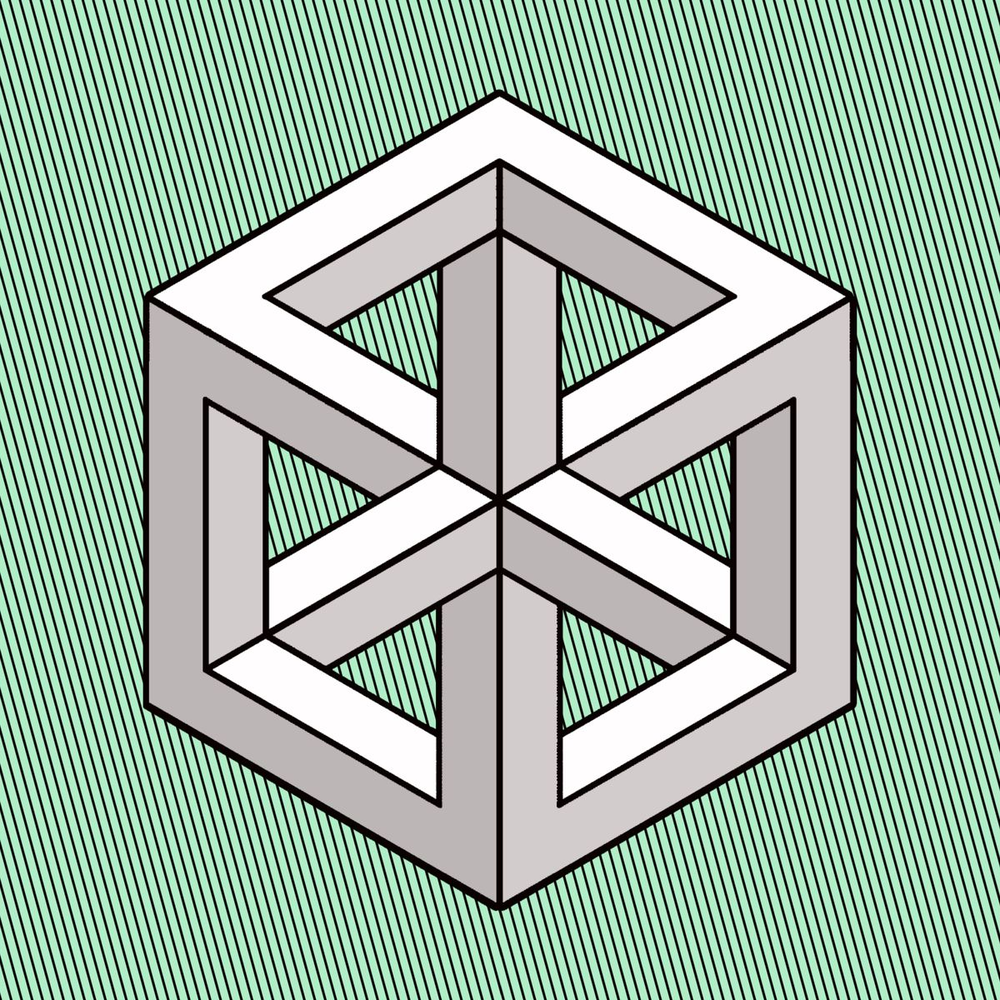
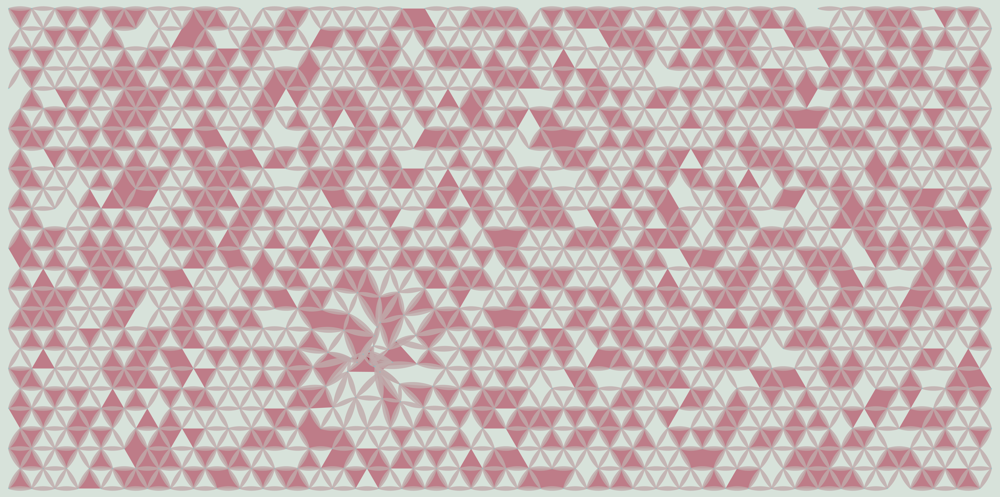
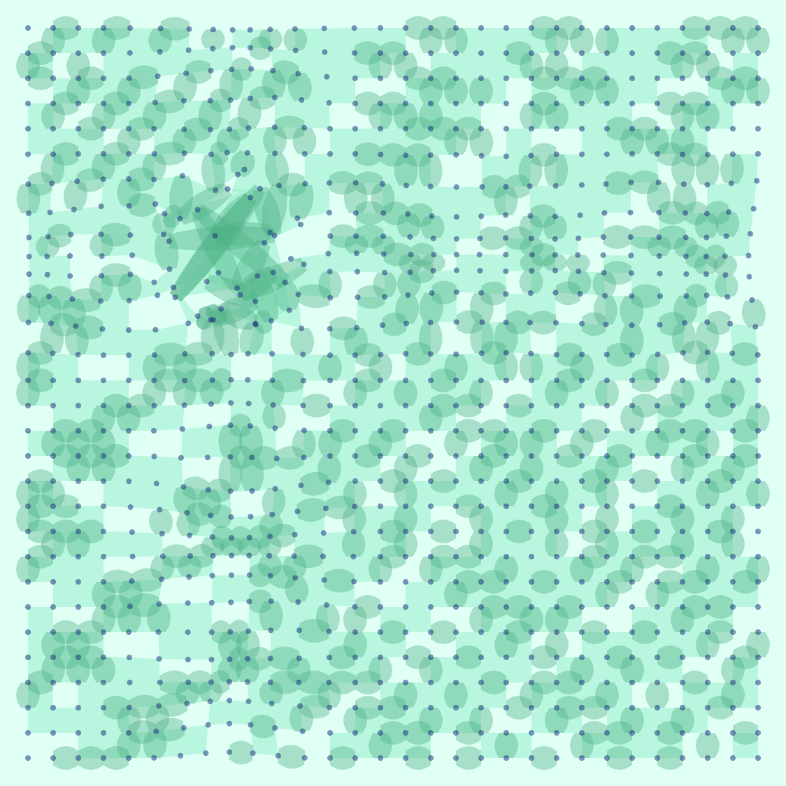

---
bannerURI:
headDescription: Professional graphic design, branding, and visual identity services by Clinamenic LLC. Specializing in logo design, brand strategy, and diagrammatic design for modern businesses and organizations.
headIcon:
keywords:
  - graphic design
  - branding
  - logo design
  - clinamenic
  - spencer saar cavanaugh
  - clinamenic LLC
  - visual identity
  - brand strategy
ogSiteName: Clinamenic LLC
ogType: website
publish: true
quartzSearch: true
quartzShowBacklinks: true
quartzShowBanner: false
quartzShowCitation: false
quartzShowExplorer: true
quartzShowFlex: false
quartzShowGraph: true
quartzShowSubtitle: true
quartzShowTitle: true
quartzShowTOC: true
subtitle: Professional graphic design, branding, and visual identity services by Clinamenic LLC. Specializing in logo design, brand strategy, and diagrammatic design for modern businesses and organizations.
tags: []
title: Design Portfolio
twitterCard: summary_large_image
twitterCreator: "@clinamenic"
type: site-page
uuid: bf82f849-e253-426f-8c18-a69446f10b32
---

---

## Graphic Design

Below are some samples of my graphic design work, showcasing a speciality for geometric and technoclassical aesthetics. I have long been a user and supporter of [GIMP](https://www.gimp.org/), which remains my preferred graphic design software.

See [[Museotheque]] for some examples of artists who have influenced me.

  

    
    
    
  

  

    
    
    
  

  

    
    
  

---

## Editorial Design

The following graphics were designed to serve as the visual components of publications, articles or other written materials.

  

    
    
    
  

  

    
    
    
  

  

    
    
    
  

  

    
    
    
  

  

    
    
    
  

  

    
    
    
  

---

## Logo Design

Below are some examples of the logos I have designed, both for clients and for organizations in which I had a position. Aesthetically I specialize in simple logos which incorporate geometric themes, often have double visual meanings, and which work in monochrome contexts.

  

    
    
    
  

  

    
    
    
  

  

    
    
    
  

  

    
    
    
  

---

## Brand Kits

For new or established brands, I can provide a kit of graphic assets geared around an event, promotional campaign, or foundational brand identity.

### Tally

 
  

---

### DAO Coalition

  

    
    
  

  

    
    
  

  

    
    
  

---

## Diagrammatic Design

Below are some examples of my organizational maps and ontological diagrams, made for the purpose of conveying complex architectures in visually streamlined and elegant manners.

  

    
    
    
        
  

  

    
    
    
    
  

    

    
    
    
    
    
  

---

## Lattelier

Below are selected output from [Lattelier](https://lattelier.clinamenic.com), a lattice-based distortion pattern generator I created and deployed to Arweave.

  

    
    
    
    
  

  

    
    
    
  

    

    
    
    
  

