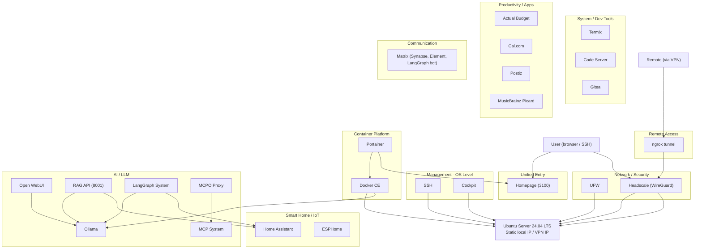

---
bannerURI:
keywords:
license:
ogSiteName: Clinamenic LLC
ogType: website
publish: true
subtitle: Working Specification and Roadmap as of 2026-03-10
tags:
title: EmbassyOS
twitterCard: summary_large_image
twitterCreator: "@clinamenic"
type: project
uuid: f1e19247-f4d6-4f07-9016-80187ec288e2
project-status: prototype
source-url:
project-type: community
active: true
---

_Disclaimer: The copy in this specification is AI-generated, informed by human direction and a variety of reference documents._

**Description**: A local-first, community-house oriented home server providing smart home automation, local AI, and secure remote access on a single-node Ubuntu stack. AI is central to the project: natural-language access to house data, knowledge bases, and services enables collective use of the system without depending on proprietary platforms or cloud APIs.

---

## Ethos

EmbassyOS is guided by two principles. **Local resilience**: the system minimizes third-party institutional dependence and keeps data and control on-site; local systems use exportable formats (e.g. markdown) so data stays portable and auditable. This supports digital autonomy and reduces reliance on extractive or surveillance-oriented platforms. **Global reproducibility**: the system aims to be protocolizable, so other communities can run it without lock-in to discretionary expertise; workflows are streamlined and documented for replication.

---

## Who it’s for and current use

The target users are community houses and similar shared-living or civic organizations that need local control over data, communication, and house operations. The system addresses the need for infrastructure that stays under community control (governance, knowledge, and decision-making visible and queryable locally) without handing data to third-party SaaS. One community house currently runs the stack in production; the roadmap includes templating and distribution so other houses can deploy it with minimal specialist help.

---

## Current Architecture

The stack runs on a single node: Ubuntu Server 24.04 LTS (Dell OptiPlex 3070), with Docker for most services, a unified web dashboard (Homepage) as the main entry point, and remote access via a self-hosted WireGuard-based VPN (Headscale) behind a tunnel service. The diagram below summarizes the layers and components.

---

## Functional (in production use)

- **Infrastructure and management**: SSH, Cockpit, Docker, Portainer, UFW firewall, Headscale (self-hosted mesh VPN), tunnel for remote access, Homepage (unified dashboard). Keeps control and traffic on-site; remote access is encrypted and does not depend on exposing services to the public internet.
- **Dev and ops**: Termix (web terminal), Code Server (web IDE), Gitea (self-hosted Git).
- **Smart home and IoT**: Home Assistant (supervised), ESPHome (device and firmware management).
- **AI/LLM (core)**: Ollama (local language model), Open WebUI (chat interface).
- **Productivity and apps**: Actual Budget, Postiz, MusicBrainz Picard.

---

## Partially functional with experimental or in-progress parts

AI is not an add-on: natural-language querying and orchestration are how residents and stewards interact with house data (sensors, knowledge base, schedules, governance docs). The following components deliver that.

- **RAG API**: Natural-language querying over Home Assistant and the knowledge base; API operational; MCP server integration planned.
- **LangGraph**: Orchestration layer for natural-language interaction with server services; API operational; Open WebUI integration in progress; current agents: Knowledge Base, Home Assistant.
- **MCP (Model Context Protocol)**: Deployed; MCPO proxy routes to multiple MCP servers (e.g. Home Assistant) with many tools; additional MCP servers (e.g. Music, health, RAG, Knowledge Base) planned.
- **MCPO Proxy**: MCP-to-OpenAPI gateway; operational; additional server integrations planned.
- **Cal.com**: Appointment scheduling; deployed but auth callback and URL configuration (e.g. NEXTAUTH_URL, WEBAPP_URL) still being stabilized for reliable use behind VPN/local access.
- **Matrix (Synapse, Element, LangGraph bot)**: Self-hosted messaging and LLM-from-Matrix room; Synapse and Element Web run and the bot can reply in a dedicated room. Mobile setup (VPN, self-signed cert, homeserver URL) and bot/room configuration are manual and still in progress; federation is disabled (VPN-only access).

---

## Aspirational (EmbassyOS vision)

Not yet implemented on this instance:

- **modernomad**: Local booking and invoicing for community houses.
- **Knowledge Garden**: Internal markdown knowledge base plus public wiki (e.g. Quartz); protocol-based sync (e.g. Git, Jazz). Makes house protocols and handbooks queryable and shareable; supports deliberation and consensus by keeping information local and transparent.
- **Archiving**: Local storage of documents and cultural artifacts with optional publish/backup (e.g. Internet Archive, Arweave).
- **Web analytics**: Self-hosted analytics (e.g. Umami).
- **Phase 2 – distribution**: Templating and pre-configured images so other community houses can deploy EmbassyOS with minimal expertise; builds toward institutional transparency and civic space at scale.

**Dependency pruning (planned):** Two examples of reducing institutional dependence:

- **Tesla solar API → IoTaWatt**: Replace Tesla cloud API-based solar monitoring with IoTaWatt, a fully local open-source energy monitor at the electrical panel. Eliminates third-party API dependency, adds consumption monitoring, and keeps all energy data on-site.
- **ngrok → Octelium**: Replace the commercial tunnel used for remote VPN access with Octelium, a self-hosted zero-trust secure access platform that can operate as an ngrok/Cloudflare Tunnel alternative and VPN. Removes dependence on a paid tunnel provider while keeping remote access.

---

## Dependencies and local-first stance

The project prioritizes local operation and exportable formats while accepting some third-party dependence where necessary (e.g. a tunnel for remote VPN access, package and container registries for updates). Internal dependency analysis and a local-first migration roadmap exist; the goal is to maximize independence for core services without sacrificing functionality.

---

## Openness and sustainability

- **Openness**: Stack is built from open-source components (Ubuntu, Docker, Home Assistant, Ollama, Gitea, Matrix, etc.). Configuration and architecture are documented; roadmap includes publishing more of the integration layer and tooling so other communities can replicate or adapt.
- **Sustainability**: Phase 2 focuses on templating and distribution to other houses. Sustainability model is community adoption and optional institutional partnerships rather than proprietary licensing; long-term viability depends on reuse and shared maintenance, not a single operator.
